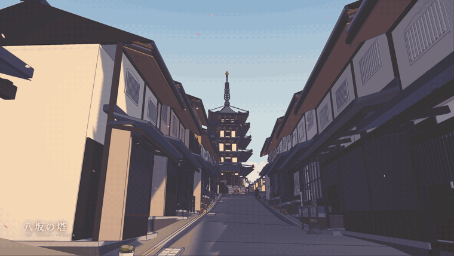
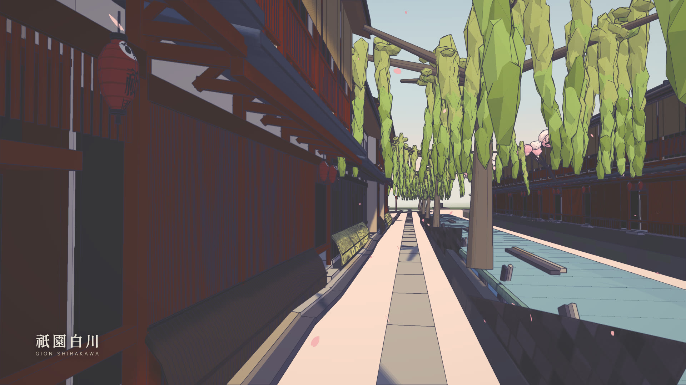
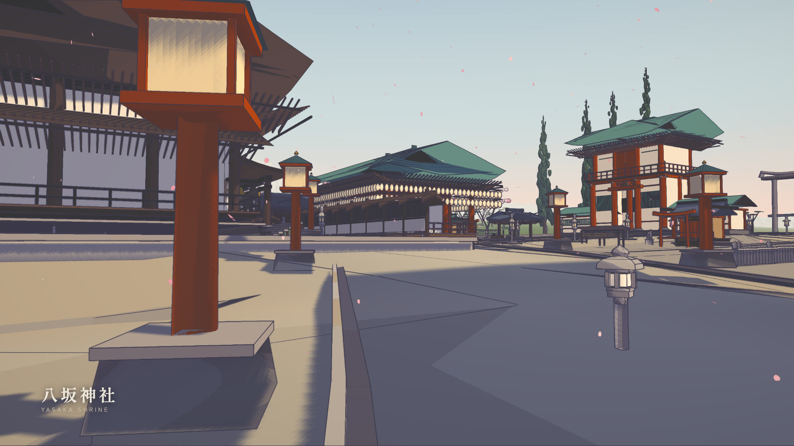
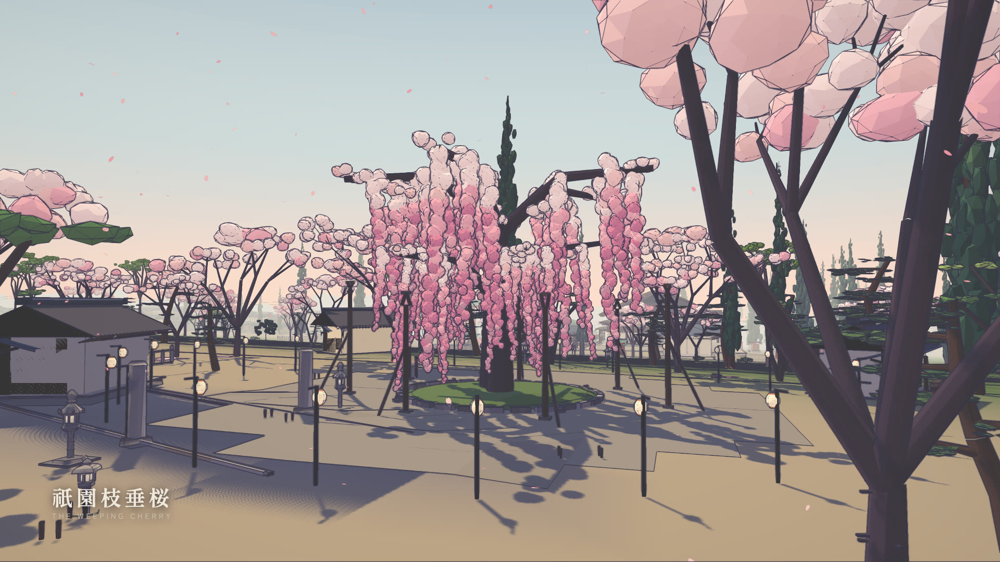
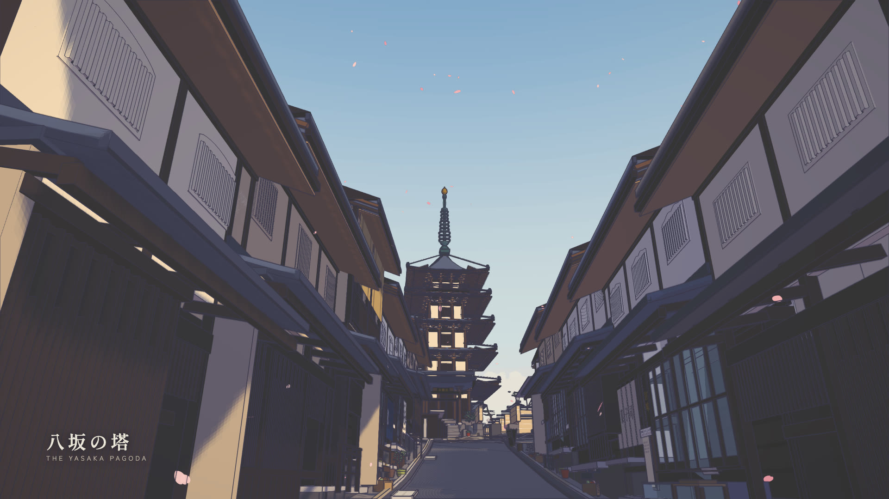
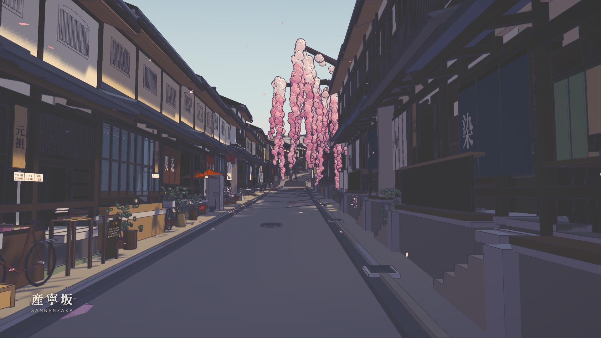
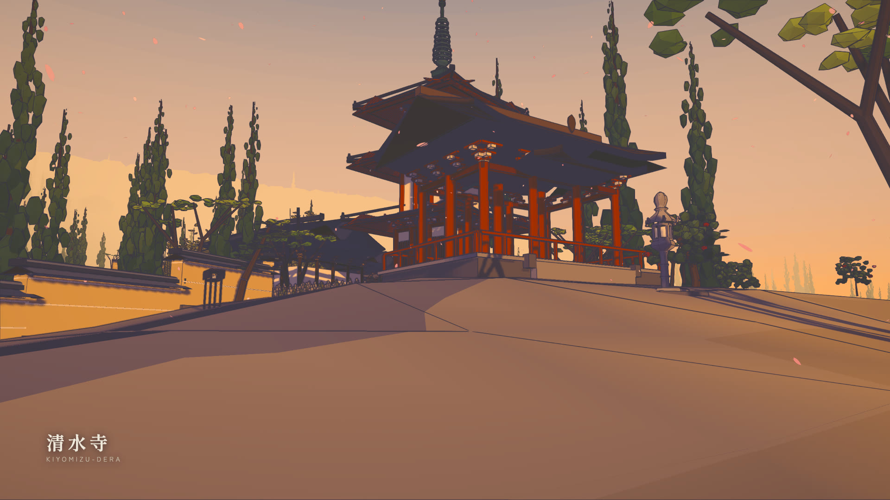

# 東山 — Higashiyama, Kyoto

A walkable reconstruction of Kyoto's Southern Higashiyama route — **Gion → Hanamikoji → Yasaka Shrine → Nene-no-michi → the Yasaka Pagoda → Ninenzaka → Sannenzaka → Kiyomizu-zaka → Kiyomizu-dera** — running in the browser on **Three.js** alone, rendered 3D-to-2D in the visual language of a hand-painted anime background.

<a href="media/kyoto-higashiyama-walkthrough.mp4"></a>

<sub>▶ **[Watch the 54-second walkthrough](media/kyoto-higashiyama-walkthrough.mp4)** (1920×1080) — seven scenes, each with the camera move its subject asks for: a descending crane over the roofs, a pan along the Shirakawa, an orbit of the Yasaka Shrine precinct, a crane up the weeping cherry, the pagoda reveal, the climb up Sannenzaka, and a pull-back from Kiyomizu-dera at sunset</sub>

No game engine, no physics engine, no external 3D assets, and **no binary assets of any kind**: every sign, noren, lantern, roof tile, lattice screen and paving stone is drawn with Canvas2D at start-up.

```bash
npm install
npm run dev        # http://127.0.0.1:5180
```

`WASD` walk · `Shift` run · mouse look (click to lock) · `E` interact · `P` overview · `F` photo mode · `T` time of day · `O` ink · `G` grade · `M` sound · `R` return · `F1` debug HUD

Or, with nothing installed at all:

```bash
npm run viewer && open viewer/higashiyama.html
```

one self-contained HTML file — the whole world inlined, with an index of all 52 authored viewpoints in walking order.

| | |
|---|---|
|  |  |
| **祇園白川** — the canal, the willows, the Tatsumi corner | **八坂神社** — the precinct, the Maiden, 240 lanterns |
|  |  |
| **祇園枝垂桜** — the weeping cherry in Maruyama Park | **八坂の塔** — the most photographed frame in Kyoto |
|  |  |
| **産寧坂** — 46 stone steps, treads of 0.70 m | **清水寺** — the Saimon and the three-storey pagoda, at sunset |

---

## What this is

The route is about 2.3 km, climbs 76 m net (101 m cumulative), and is
**continuously walkable end to end** — you can start on Hanamikoji and walk to
the Kiyomizu-dera stage without a loading screen or a locked door.

It is a real place, so it is reconstructed rather than invented. Positions come
from OpenStreetMap footprints and way nodes; **every elevation is an independent
point query against the GSI 1 m airborne-LiDAR bare-earth DEM** — about 200 of
them — and street widths were measured by casting perpendicular rays to the OSM
building polygons every 8 m along each centreline. Architectural dimensions come
from cultural-property records, restoration reports and published surveys, with
confidence flagged per figure.

Where the sources disagreed, the survey won and the popular number lost:

| | commonly stated | measured | source |
|---|---|---|---|
| Yasaka Pagoda height | 46 m | **38.79 m** | Hamashima 1969 (AIJ), from the Kyoto Pref. preservation drawings; the 46 m is explicitly 公称 |
| Kiyomizu stage deck | 240–250 m ASL | **115.5 m** | GSI DEM; 240 m is the *ridge behind* the temple |
| Kiyomizu stage size | 18 × 10 m | **21.8 × 9.6 m** | the popular figure gives 183 m², contradicting the temple's own ~200 m² |
| stage pillars | 139 | **168** (78 under the stage) | the 139 is hedged and uncited |
| stage pillar diameter | ~2 m | **0.64 m** | the 2 m is 周囲 (circumference) misread as 直径 |
| Sannenzaka steps | — | **46 over 32 m** | OSM way 179116810 |
| Ninenzaka steps | — | **17 over 15.9 m** | OSM way 30882783 |

Those step counts matter more than they look: they give treads of 0.70 m and
0.94 m against 130–150 mm risers. These are Kyoto **slope-stairs** — closer to a
ramp with interruptions than to a staircase — and building them at a European
280/175 would make both streets twice as steep as they are.

---

## Project layout

| path | what |
|---|---|
| `src/data/route.js` | **The geographic contract.** Origin, axes, the landmark table, every street as a polyline with measured widths and elevations, the district boxes. Nothing else may hold a coordinate that contradicts it. |
| `src/world/terrain.js` | **The one height function.** Everything queries `heightAt`. The hillside is derived from the surveyed streets by inverse-distance weighting; stepped streets are quantised analytically from arc length. |
| `src/world/streets.js` | Paving ribbons sampled from the height field, gutters, kerbs, stone step nosings, retaining walls, the Shirakawa canal. |
| `src/world/plots.js` | Plot layout: walks a street's frontage and hands back ken-snapped plots with facing and ground height. |
| `src/world/*.js` | One module per district. |
| `src/world/vegetation.js`, `petals.js`, `props.js` | The central batchers. Districts *declare* trees and props; these build them once, instanced. |
| `src/kit/roof.js` | Roofs: gable, hip, hip-and-gable, shed, pent, karahafu, brackets, rafters, ridge finials. Curvature (mukuri / sori) is the whole point. |
| `src/kit/machiya.js` | The Kyoto townhouse generator, on the 内法 clear-dimension module. |
| `src/kit/shrine.js`, `temple.js`, `pagoda.js` | Hero-structure generators. |
| `src/core/` | Palette, cel shading, the post pipeline, outlines, Canvas2D textures, player, sky, audio. |
| `tools/` | `capture.mjs` (hero renders), `perf.mjs`, `walkthrough.mjs`. |
| `docs/KIT.md` | The builder contract every module is written against. |
| `docs/recon/` | The reconnaissance: `GEO.md`, `ARCH.md`, `STREET.md`, `METHOD.md`. |

---

## The rendering

Three passes over a cel-shaded scene.

**Toon materials with tinted shadow bands.** Everything uses `MeshToonMaterial`
with a hand-authored ramp, so direct sun quantises into 2–4 flat bands. On top
of that the toon BRDF is patched so the darker bands shift toward a *cool violet*
rather than merely going darker — that hue shift is most of what separates
"anime cel" from "low-poly 3D with a posterise filter". Blossom, paper, plaster
and shrine gravel use **high-key ramps** whose darkest stop is still bright, so a
cherry tree never turns into a dark blob on its shadow side.

**Screen-space ink from a second difference of depth.** Not a Sobel. A first
difference (or any image-gradient edge filter) fires wherever a surface grazes
the camera, so the road inks solid from fifteen metres out. The second difference
is flat across *any* plane no matter how oblique, and only fires on real
silhouettes and real creases. Positive curvature — the near side of a silhouette,
a convex ridge — inks strongly; negative curvature — inside corners, where a wall
meets the ground — inks faintly, which is exactly the lighter contact line an
animator draws.

**A split-tone grade**: cool violet in the darks, warm paper white in the lights,
lifted blacks, controlled saturation. No bloom, no depth of field, no motion blur,
at any time of day.

**Inverted-hull outlines** are used *sparingly* — the pagoda, the shrine gates,
the temple. The two systems have a hierarchy: the ink pass is observed line work,
the hull is drawn line work, and outlining everything destroys the distinction.

A four-light rig: a warm quantised key, a strong **cool** directional fill from
the opposite quarter that carries the whole shadow side, a violet up-light so the
many deep eaves never go flat black, and a hemisphere with a violet ground
colour. The shadow camera follows the player on a snapped 2 m grid — unsnapped,
every cast edge crawls as you walk, and on a street of lattice screens that reads
as the whole facade shimmering.

---

## Performance

Draw calls and triangles are tracked, in that order. Wall-clock in a headless
browser drifts 20–30 % run to run, so a frame time that moved is rarely evidence
of anything; draw calls are exact and reproducible.

The core optimisation is the **baker** (`src/core/util.js`): colour goes into a
vertex attribute and everything sharing a *shading* signature — ramp bands,
shadow tint, transparency, side — merges into one geometry with one material.
A single machiya facade is ~250 elements; as separate meshes, sixty of them plus
their shops would be fifteen thousand draw calls. Through the baker a whole
district is a handful.

```bash
node tools/perf.mjs             # draw calls, triangles, frame time per hero view
node tools/capture.mjs          # every hero view at 1600×900
node tools/walkthrough.mjs      # drives the player along the whole route
node tools/passability.mjs      # sweeps every street for a walkable lane
node tools/check.mjs            # syntax-checks every source file
```

The tour film is recorded the same way, from the same world:

```bash
node tools/tour_video.mjs       # 2,670 frames at 1920×1080
node tools/tour_encode.mjs      # mp4 + preview gif + stills
node tools/tour_video.mjs --fps=1 --w=960 --h=540 --out=media/storyboard
```

That last one is the useful one while you are cutting: one frame per second is a
storyboard of the whole film in six seconds of rendering, and it is how every
shot in the current cut was framed. It caught, among other things, that the
`look` targets were being written as heights above local ground when the world
uses absolute elevation — so every street shot was aimed at the pavement four
metres ahead.

`walkthrough.mjs` is the test that catches what screenshots cannot: it steers the
*player* with the real movement and collision code and reports any segment it
cannot walk and any discontinuity in the ground under it.

---

## Verifying visual changes

Nothing in this project is judged by reading its source. Render it, open the
JPEG, and compare it to a photograph of the real street. Every significant bug
found while building it threw nothing and logged nothing:

- a ridge-cap cylinder with one rotation too many grew an eight-metre pole
  lying across every roof in the world
- a facade yaw off by π put every building's body over the carriageway, with
  the camera embedded in a wall
- a naive LCG in the texture generator lost precision past 2^53 and returned a
  near-constant, so every paving stone came out the same tone and the granite
  read as flat tan
- a terrain grid interpolating linearly between 6 m samples rode *above* the
  paving it was sampled from, hiding it completely
- a height field with a kink in its derivative put a black ink line down both
  sides of every street, converging on the vanishing point

None of these produced an error. All of them were obvious in a render.

---

## License

MIT. Reconnaissance derived from OpenStreetMap (ODbL), the GSI elevation
service, and published cultural-property records; see `docs/recon/` for the
per-figure sourcing and the uncertainty registers.

---

## Standalone viewer

```bash
npm run viewer      # vite build + inline into one file
open viewer/higashiyama.html
```

`viewer/higashiyama.html` is the whole world in a single self-contained HTML
file — no server, no `node_modules`, nothing to install. Double-click it.

It wraps the production bundle in a viewer shell that a game does not need:

- an **index of all 52 authored viewpoints in walking order**, grouped into the
  six acts of the route, so scrolling the list is the walk;
- **drag-to-look**, because a page opened from `file://` or served in a frame
  cannot take a pointer lock, and the world is unusable if turning around
  depends on one. It writes the same `yaw`/`pitch` the locked path writes, and
  stands down if a real lock does succeed;
- time of day (朝 昼 夕 暮), and independent **Ink** / **Grade** toggles so the
  two post passes can be seen separately.

`viewer/build.mjs` emits two files from one set of sources so they cannot
drift: `higashiyama.html` (a complete document, for opening off disk) and
`higashiyama-viewer.html` (a body fragment, for a host that supplies its own
skeleton).

The bundle is **inlined rather than linked** deliberately: a `<script src>`
beside a `file://` page is fine, but a `type="module"` one is CORS-checked even
for local files and fails to load. An inline module has nothing to fetch.
