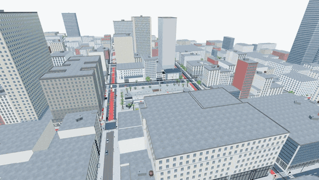
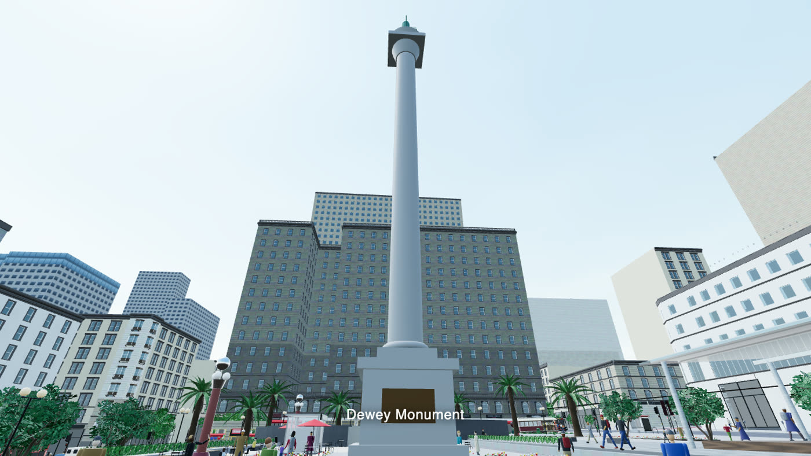
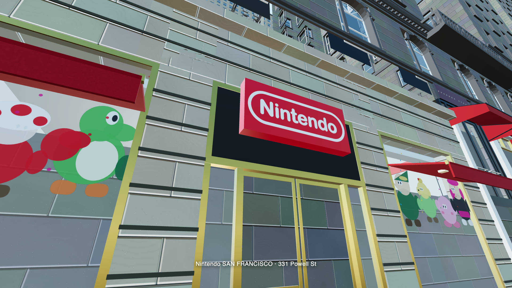
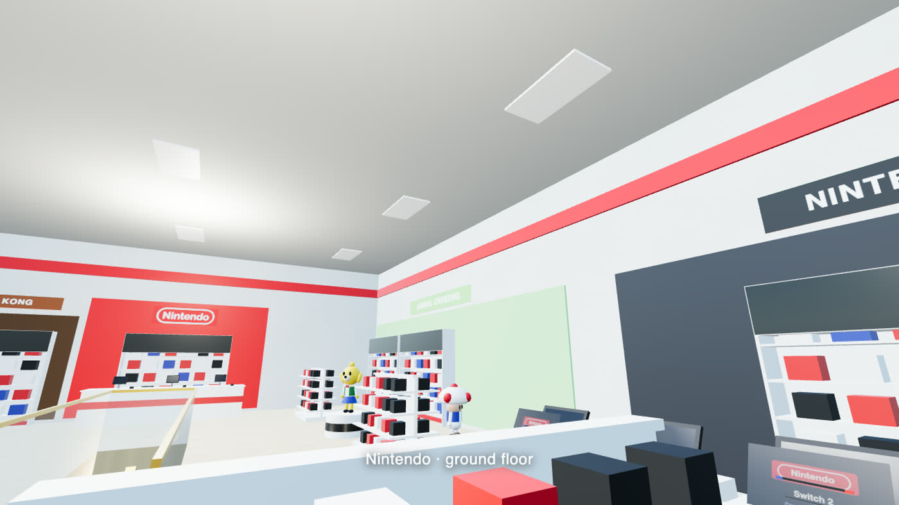
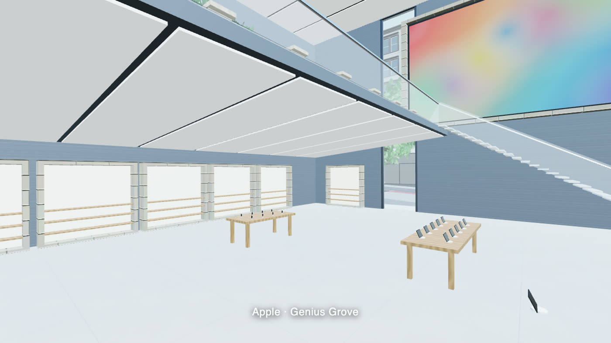
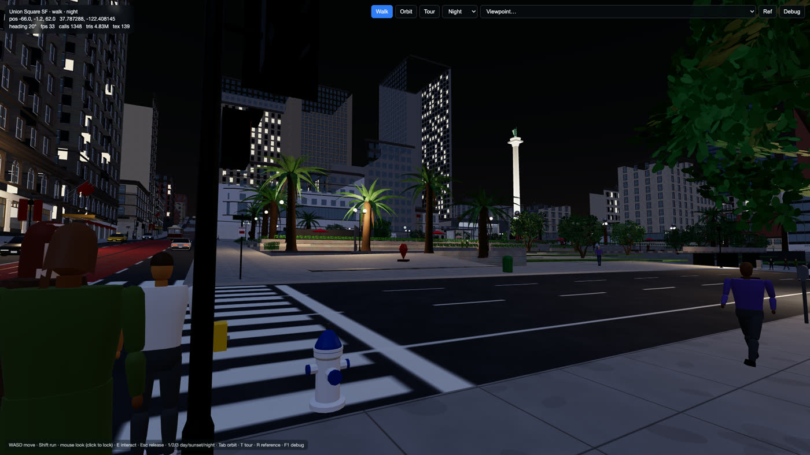
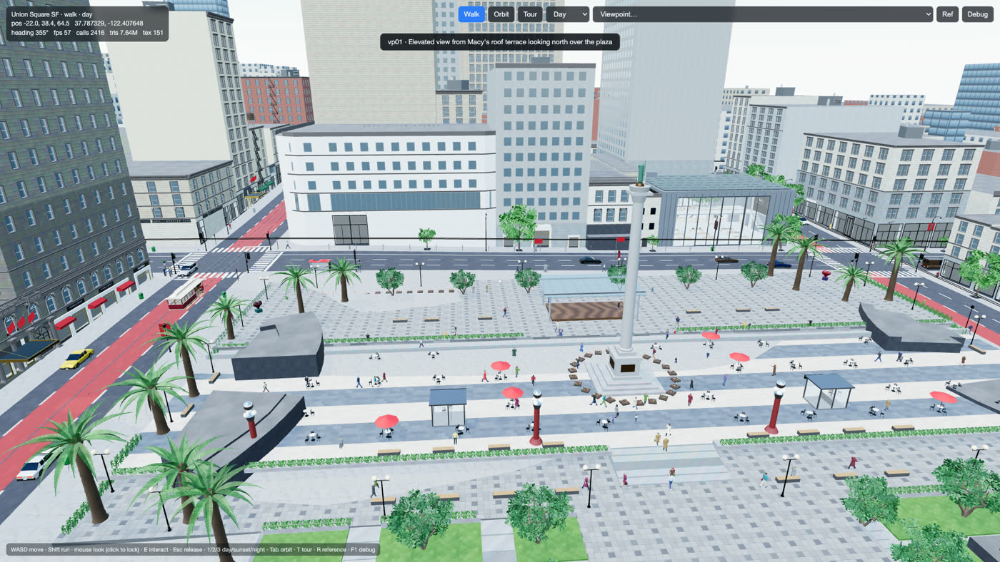
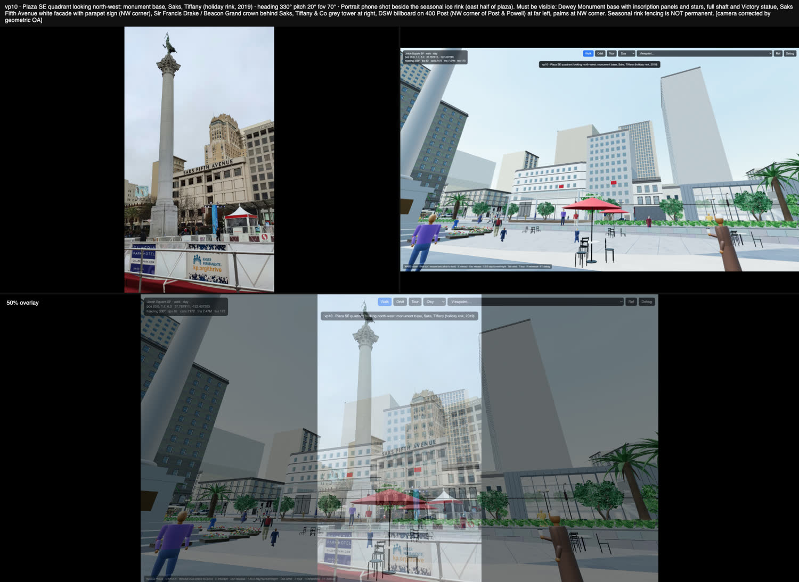

# Union Square, San Francisco — an interactive digital twin

A walkable reconstruction of San Francisco's Union Square and the blocks around it, running in the browser on **Three.js** alone. Real terrain, the real street grid, 129 identified storefronts, working signals and cable cars, day/sunset/night, and two interiors you can walk into: **Apple Union Square** and **Nintendo SAN FRANCISCO**.

<a href="media/union-square-walkthrough.mp4"></a>

<sub>▶ **[Watch the 59-second walkthrough](media/union-square-walkthrough.mp4)** (1920×1080) — aerial sweep, Dewey Monument, into Nintendo, down to the lower level, into Apple</sub>

```bash
npm install
npm run dev     # http://localhost:5173
```

`WASD` walk · `Shift` run · click to capture the mouse · `E` interact · `Tab` orbit · `T` cinematic tour · `1` `2` `3` day/sunset/night · `R` reference overlay · `F1` debug HUD

---

## What you can do

| | |
|---|---|
| **Walk the square** | Human-scale movement with collision, curbs, plaza terraces and stairs, from Powell to Stockton |
| **Read the street** | 129 storefronts carrying their real 2025–26 tenants, addresses, status and signage |
| **Go inside** | Apple Union Square (sliding glass front, mezzanine, Forum video wall, Genius Grove) and Nintendo SAN FRANCISCO (two floors, Mario/Zelda/Animal Crossing zones, Switch 2 demo kiosks) |
| **Interact** | 23 objects: doors that open as you approach, demo kiosks, `?` blocks that bounce and drop coins, product inspection, presentation screens |
| **Watch the city run** | 220 pedestrians with behaviours (commuter, shopper, tourist, sitter, crosser), 109 vehicles, Muni buses, Powell St cable cars, signals on a 60-second cycle |
| **Change the light** | Day, sunset and night with lit shopfronts, street-lamp pools and an uplit Dewey Monument |
| **Check the work** | A developer overlay that fades a real photograph over the render from the same camera |

<p align="center">
  
  <br>
  
  <br>
  
  
</p>

## The brief

This world was built autonomously from a single prompt, kept verbatim in [`PROMPT.md`](PROMPT.md): reconstruct Union Square in Three.js, research it first with parallel agents, generate the assets offline with Blender-as-a-library, verify every milestone against photographs, and have independent reviewer agents grade the result.

## How it is built

Nothing here is hand-placed by eye. The scene is assembled at load time from data:

**1 · Reconnaissance.** Eleven parallel research agents produced `src/data/recon/`: 453 OpenStreetMap building footprints, USGS 3DEP elevations (1,317 samples), a street and transit specification (lane counts, one-way directions, red transit lanes, cable-car track positions), a plaza survey, a 122-entry storefront census, dedicated studies of the Apple and Nintendo stores, and 34 reference viewpoints. Every fact carries a source and a confidence level; nothing unverified is invented.

**2 · Geospatial frame.** `src/geo/geo.ts` pins the origin to the Dewey Monument (37.787935, −122.407520, 23.94 m NAVD88) and rotates the world to the real street bearing (80.686°), so Powell climbs toward Nob Hill exactly as it does in life and every façade sits on its true lot line.

**3 · Offline asset kits.** Blender-as-a-library (`bpy`) scripts under `tools/bpl/` generate 206 optimised GLB modules — windows, cornices, storefronts, marquees, streetlights, signals, benches, hydrants, vehicles, palms, retail fixtures, character statues, pedestrian body parts — all parameterised, all under tight triangle budgets. Blender is never part of the runtime.

**4 · Spec-driven façades.** `src/world/facade/` turns a JSON description of a building into geometry: a ground band that steps with the sidewalk slope, storefront bays with real tenants and signage, window modules on a bay rhythm, stringcourses, cornices, parapets, rooftop clutter. 75 buildings are hand-authored in `src/data/facades/`; the rest are derived automatically and take their tenants from the storefront census.

**5 · Life.** A 1,398-node navigation graph over sidewalks, crosswalks and plaza stairs drives instanced pedestrians with procedural walk cycles; a lane graph drives IDM-style traffic that stops at red lights, plus buses and cable cars on their real routes.

## Camera-match validation

The project is checked against reality, not against itself. `tools/qa/capture.mjs` drives the real application to 34 fixed viewpoints defined by latitude, longitude, heading and field of view; `tools/qa/compare.mjs` renders each one beside the free-licensed photograph taken from the same spot, plus a 50 % overlay.

<p align="center">
  
</p>

Nine independent reviewer agents — geometric, semantic (is the right business in the right place?), architect, SF local, environment artist, technical artist, interaction — filed the reports in [`qa/reports/`](qa/reports/), which drove fix cycles. Their **unadjusted** second-pass scores and the remaining known gaps are in [`FINAL_QA_REPORT.md`](FINAL_QA_REPORT.md) and [`qa/discrepancies.md`](qa/discrepancies.md). Where the reconstruction is still weaker than the target bar, the report says so and names the fix.

```bash
node tools/qa/capture.mjs --out=qa/shots/day        # screenshot all 34 viewpoints
node tools/qa/compare.mjs --shots=qa/shots/day --out=qa/compare/day
node tools/qa/walkthrough.mjs                       # 18-step scripted user journey
node tools/qa/perf.mjs --headed=1                   # fps / draw calls / triangles
node tools/qa/demo_video.mjs --fps=30               # re-record the walkthrough film
```

## Numbers

| | |
|---|---|
| Reconstruction boundary | ≈ 800 × 720 m — Mason to Grant, Sutter to O'Farrell, with context beyond |
| Buildings | 453 footprints · 75 authored façade specs · 11,950 façade openings |
| Storefronts | 129 identified (97 % high/medium confidence, sourced 2024–26) |
| Interiors | 2 full · 23 interactive objects |
| Crowd & traffic | 220 pedestrians · 109 vehicles · 36 signalised crossings |
| Generated assets | 206 GLB files, 5.1 MB total |
| Validation | 34 viewpoints · 147 comparison sheets · 9 reviewer reports · 18/18 walkthrough checks |
| Performance (1080p, headless Chromium) | 57–89 fps at street level · 34–42 fps aerial · 38–75 fps at night |

## Repository layout

```
src/
  geo/        geospatial frame (WGS84 ↔ local metres, street-grid rotation)
  data/       recon/  research database (GIS, elevation, streets, plaza, storefronts, viewpoints)
              facades/ authored façade specs per sector
  world/      terrain · street grid · plaza · building massing · façade engine · props · vegetation
  interiors/  Apple and Nintendo hero modules
  life/       nav graph · pedestrians · lane graph · traffic · traffic lights
  systems/    time of day · night lighting · interaction
  player/     walk · orbit · cinematic tour
  materials/  procedural PBR library · façade tile textures · signage and vector logos
  debug/      HUD · reference viewpoints · photo overlay · QA automation surface
tools/
  bpl/        Blender-as-a-library asset generators (offline)
  geo/        GIS builder, data sync, footprint edge inspector
  qa/         Playwright: capture, compare, walkthrough, perf, demo film
docs/         reconnaissance reports and the façade-spec authoring brief
qa/           reviewer reports, scores, discrepancy log, perf samples
media/        walkthrough video, preview GIF, stills
```

## Data, sources and licensing

Geometry is reconstructed from [OpenStreetMap](https://www.openstreetmap.org/copyright) (ODbL) and USGS 3DEP elevation (public domain), guided by public records and free-licensed photographs. **No proprietary 3D meshes or map imagery are shipped.** The reference photographs themselves are not redistributed in this repository; their file-by-file provenance (Wikimedia Commons page, author, licence, date) is preserved in `refs/*/SOURCES.md` so the validation set can be re-fetched. Brand names and logos appear only to identify the real businesses at their real addresses and remain the property of their owners. Where a storefront's occupant could not be verified from a 2024-or-later source, it is rendered with a neutral fascia and recorded as unresolved rather than invented.

Code and generated assets are MIT-licensed.
